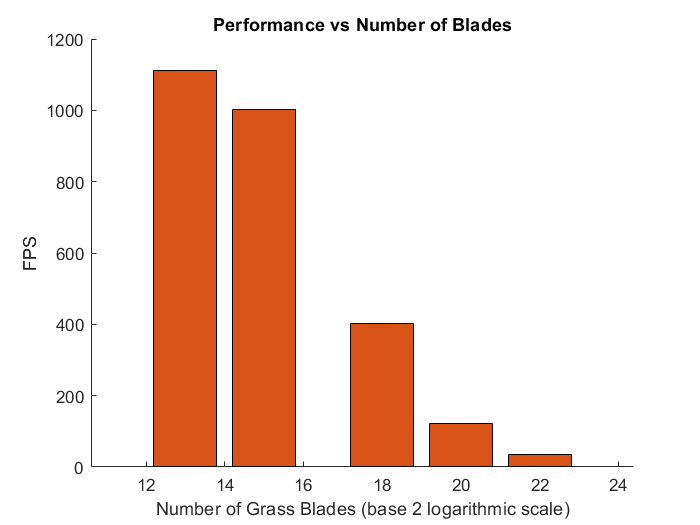
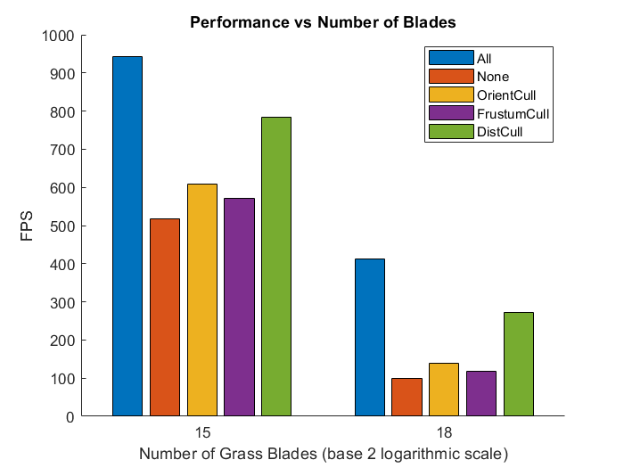

# Vulkan Grass Rendering
================

**University of Pennsylvania, CIS 565: GPU Programming and Architecture, Project 3**

* Weiqi Chen
  * [LinkedIn](https://www.linkedin.com/in/weiqi-ricky-chen-2b04b2ab/)
* Tested on: Windows 10, i7-8750H @ 2.20GHz 2.21GHz, 16GB, GTX 1050 2GB

**QUICK NOTE**: Please use `git clone --recursive` when cloning this repo as there are submodules which need to be cloned as well.

| View 1  | View 2 |
| -- | -- |
|  |  |

## Summary:
This project uses Vulkan to implement a grass simulator and renderer. A compute shader is used to perform physics calculations on Bezier curves that represent individual
grass blades. Three types of methods to cull grass blades which don't contribute to a frame are implemented to increase rendering speed for optimization.

A vertex shader is used to transform Bezier control points, tessellation shaders to dynamically create
the grass geometry from the Bezier curves, and a fragment shader to shade the grass blades.

## Performance Analysis

### Number of Grass blades

The plot below shows the FPS change with respect to the increase of number of blades. It is expected that as the number becomes large, FPS decreases significantly. This data is collected with all culling methods used.

### Culling Optimization

* Orientation Culling: Each grass blade is a 2D object and has no width. Therefore when the view direction from camera is perpendicular to the blade's front face direction, we will render parts of the grass smaller than the size of a pixel and get aliasing artifacts.

* View-frustum Culling: Grass blades which are outside the view-frustum won't show up in the frame and therefore there is no need to render them.

* Distance Culling: Grass blades which are too far away and smaller than the size of a pixel don't contribute to a frame and can be culled.

This plot below shows the optimization effect due to culling methods.
As can be seen, the best performance is reached when all culling methods are used. Distance culling contributes most among others, while view frustum culling relatively contributes the least. It is worth noting that when the camera position is changed, frustum culling may contribute more than this case.

