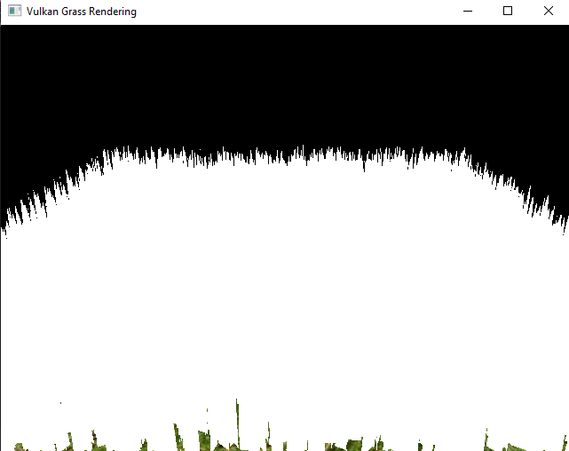
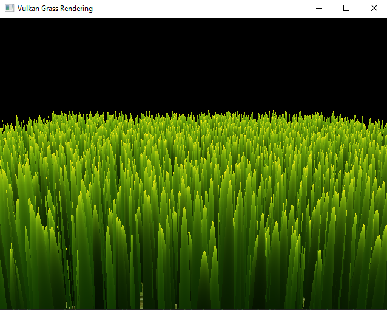
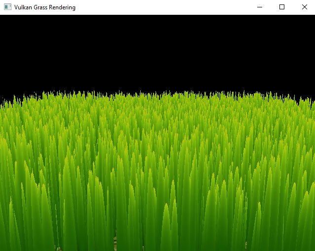
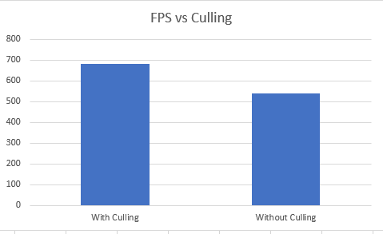

Instructions - Vulkan Grass Rendering
========================

**University of Pennsylvania, CIS 565: GPU Programming and Architecture, Project 3**

* Alexis Ward
  * [LinkedIn](https://www.linkedin.com/in/alexis-ward47/), [personal website](https://www.alexis-ward.tech/)
* Tested on: Windows 10, i7-8750H CPU @ 2.20GHz 16GB, GTX 1050 Ti 

# README

**Summary:**
This is my first time using Vulkan. In this repository, I implemented a grass simulator and renderer. I represented individual grass blades as Bezier curves, and I used compute shaders to perform physics calculations on them and to cull unneeded blades for efficiency. After this, the remaining blades are passed into several resulting shaders. This includes tessellation shaders that dynamically create the grass geometry from Bezier curves and a fragment shader to shade the blades. I additionally built off the base code to bind all descriptors needed to accomplish this end result.

This project is an implementation of the paper, [Responsive Real-Time Grass Rendering for General 3D Scenes](https://www.cg.tuwien.ac.at/research/publications/2017/JAHRMANN-2017-RRTG/JAHRMANN-2017-RRTG-draft.pdf).
This paper was my primary resource while implementing your grass renderers. 

In this ReadMe, I will elaborate on the order in which I completed this assignment

## Binding Data - Learning Vulkan

All the data management occurs in the `Renderer.cpp` file.

I first began with the `DescriptorSetLayout` functions, and then incorporated them into the appropriate `DescriptorSet` functions. These determined the types of information bound to my shaders. Other little additions throughout the file were made in order to bind and dispatch the actual descriptors.

I was thankfully able to reference the base code for this, and, with a lot of trial and error (and referencing the many possible Vulkan function inputs), I got my program to run without crashing. After that happened I moved onto filling in basic variables for each shader in order to get a visual.

## Tesselations and Bezier Curves

Prior to incorporating physics in my grass simulation, I wanted to display the grass' shape itself. In the tessellation control shader, I specified that the horizontal tessellation level be 2 and the vertical be 8. This means that there are about 32 triangles per blade, I believe. 

The generated vertices (created in the tessellation engine) are passed to the tessellation evaluation shader, where I place the vertices in world space and place them on a Bezier curve.

My result

## Fragment Shader

Super fun part: I enjoyed playing with all the color options 

  

## Physics

After adding a simulation of gravity, blade stiffness, and wind (as described below), the scene truly comes together.

#### Gravity

Given a gravity direction, and the magnitude of acceleration, we can compute the environmental gravity, `gE`. To view how this would effect the tilt of each blade, we combine it with "front gravity," `gF`, which is the contribution of the gravity with respect to the front facing direction of the blade.

#### Recovery

Recovery corresponds to the counter-force that brings our grass blade back into equilibrium. This force is determined by comparing the current position of the Bezier endpoint to its original position, and multiplying the difference by this blade's stiffness.

#### Wind

In order to simulate wind, I chose a set wind direction, and varied its intensity across the grass based on the grass blades' origin points (and elapsed time) plugged into sin and cos functions. 

#### Total force

The next tansformation for the Bezier curve is the sum of these forces scaled by the change in time. With some more code to assure that the grass length doesn't change from the forces, we can render moving grass!

## Culling

#### Orientation culling

Since our grass blades are made from Quads and have no width, there is no need to try and render grass that faces perpendicular to the camera. We'd be trying to render parts of the grass that are actually smaller than the size of a pixel. Thus it is best to cull them. This was implemented by doing a dot product of the view vector and front face direction and seeing if it hits the threshold value of `0.9` to cull.

#### View-frustum culling

For this type of culling, I casted the blade origin point, endpoint, and midpoint into NDC, and, using the supplied `inBounds` function, checked if the given blade will show in the frame.

With a well chosen tolerance, you cannot see the effect of View-Frustum Culling (or Orientation Culling) outside of the performance analysis.

#### Distance culling

Similarly to orientation culling, we can end up with grass blades that at large distances are smaller than the size of a pixel. So I decided on a max distance of 28 after which all grass blades will be culled. And I also created four 'buckets' based on the non-culled grass distances, where the grass blades in the bucket closest to the camera are kept while an increasing number of grass blades are culled with each farther bucket.

Bucket 1 is between distances [0, 7) and there is no culling.

Bucket 1 is between distances [7, 14) and every eigth blade is culled.

Bucket 1 is between distances [14, 21) and every fourth blade is culled.

Bucket 4 is between distances [21, 28) and every other blade is culled.

The upper picture below includes the bucket-based culling; for comparison, the bottom image only culls after 28 units.

    

## Performance Analysis

The performance analysis is where you will investigate how...
* Your renderer handles varying numbers of grass blades
* The improvement you get by culling using each of the three culling tests

