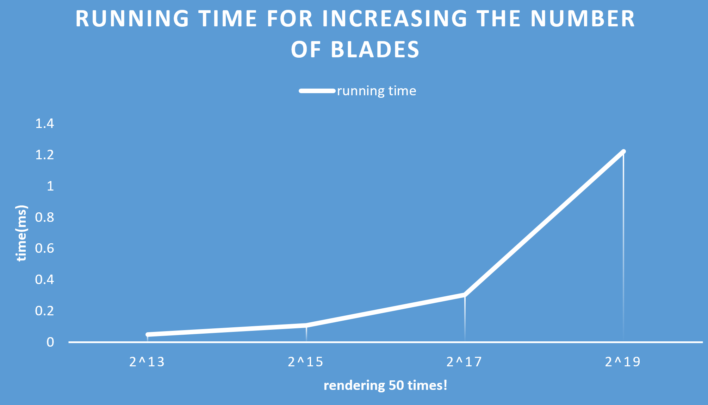
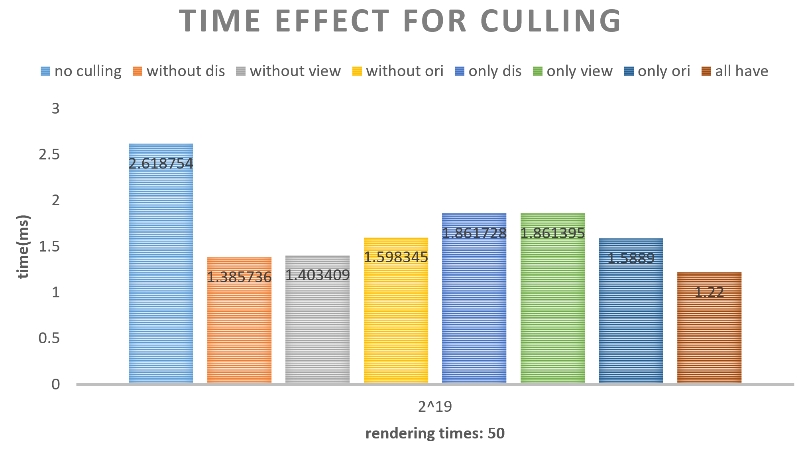
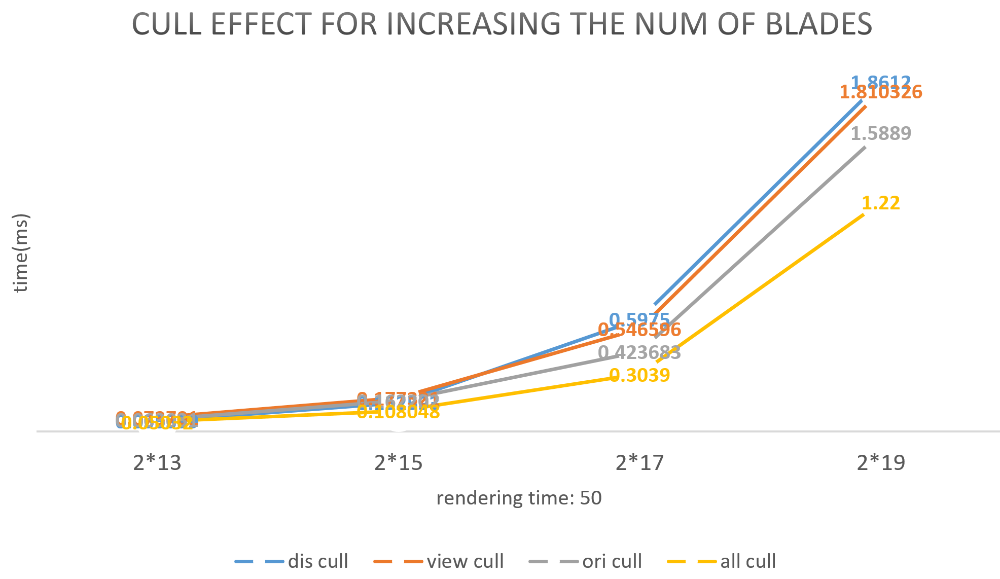
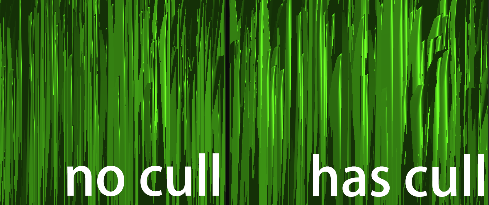

# Vulkan Grass Rendering

**University of Pennsylvania, CIS 565: GPU Programming and Architecture, Project 4**

- Yan Dong
  - [LinkedIn](https://www.linkedin.com/in/yan-dong-572b1113b/)
  - [personal website](https://www.coffeier.com)
  - [github](https://github.com/coffeiersama)
- Tested on: Windows 10, i7-8750 @ 2.22GHz  (12CPUs)  16GB, GTX 1060 14202MB (OMEN 15-dc0xxx)

[Result](#result) - [Rules](#feature) - [Performance Analysis](#performance-analysis) - [Errors](#error)

## Result:

## Feature

#### Grass pipeline 

- grass.vert
- tess control (level based on depth)
- tess eval
- grass.frag

#### Compute pipeline

- orientation culling + view culling + distance culling
- wind force + gravity + recovery force 

each pipeline is independent, the grass pipeline is for drawing grass and the compute pipeline is for calculating force and updating the grass shape.

#### Basic Vulkan Pipeline Review

Here is a picture for the whole pipeline. What is vulkan? Vulkan is the core APIs for the graphics pipeline, it save the important part of the graphics pipeline, and cut lots of auto doing steps compared to OpenGL.  So it is fast but hard to code(lots of things need to be set by users).

The Grass pipeline is the rendering pipeline, we pass vertex data into vertex shader->tess control shader->tess eval shader->fragment shader->frame buffer. And then, the framebuffer will interact with swap chain to show the rendering picture(this part is similar with OpenGL). The different part is that the data is read from a pool. The compute shader compute forces and apply to the vertex data of the grass, put the data into this pool, and then let the grass pipeline do the rendering. 

#### Algorithm

The grass is made by Bezier curve, we use 3 control point to generate. As show in the image, the v0 is the point that on the ground, and v1 is the middle control point, v2 is the last control point and it is the other end point of the grass.  

Note: orientation vector: vec3(cos(dir), 0 sin(dir))

#### Tessellation Shader

Tes control shader is used to do the subdivision and the Tes ecal shader is used to compute the new position of sub points. 

In this project, I let the tessellating level changing based on the depth of the grass.

Note: control shader has inner and outer subdivision setting.

outer: 0->3: right->top->left->bottom

inner: horizontal -> vertical

#### Force and culling

In the paper, the author explain for each force and culling we need to add. I just follow the paper.

For gravity, consider the bend with respect to its front direction, so add gf to basic ge.

​				Front gravity (gF)  =  (¼) * ||gE|| * f

The recovery is simple, so skip discussing it.

For wind, I use sin and cos function, combine the total time and the position of v0 of each blade, finally generate the wind intensity. Besides, add the wind align factor consider the following 2 rules:

`First, a blade of grass that is standing in its straight position should be influenced more by the wind than a blade that is pushed to the ground. In addition, if the direction of the force caused by the wind is directed along the width of the blade, the influence should be less than if the direction of the wind is orthogonal to the blade.`

Three Culling:

For orientation culling, the blades do not have thickness, so we need to check the direction of it, and make sure we can see the face, instead of just a line (then it will be culled!).

For distance culling, set a max distance and subdivide the part between 0 to max distance into sever levels, in each level we cull different amount of blades, the nearer, the less.

 

For view culling, the main idea is based on the projection matrix of the camera. After do a series of matrix multiply, We transfer world point into NDC and generate a View-frustum. By checking if the point is in this frustum, we can culling the outside blades when we move the camera into different position.

## Performance Analysis

#### renderer handles varying numbers of grass blades

When I increase the number of the blades, the costing time increase as well. That's easy to understand, more blades, more time.

#### The improvement  get by culling using each of the three culling tests

When handling the same amount of blades, the three culling can save around a half of time! It is really a lot! Compared to the distance culling and view culling, the orientation culling saves most time, since it do not be affected by the camera and can check every blades.

Increasing the amount of blades, the tendency of saving time keep being same among the three culling method. 

## Error

The strange problem is when I first try to apply force to the grass, I find that the grass may suddenly start from a very low height to the origin height. That's because I do not use dot in compute shader, I use *.

## Very Useful Ref

http://in2gpu.com/2014/07/12/tessellation-tutorial-opengl-4-3/

https://vulkan-tutorial.com/Drawing_a_triangle/Drawing/Command_buffers

https://www.khronos.org/opengl/wiki/Compute_Shader

## Thanks

Thanks Mark(Tianming) Xu for helping me with some basic concept! 