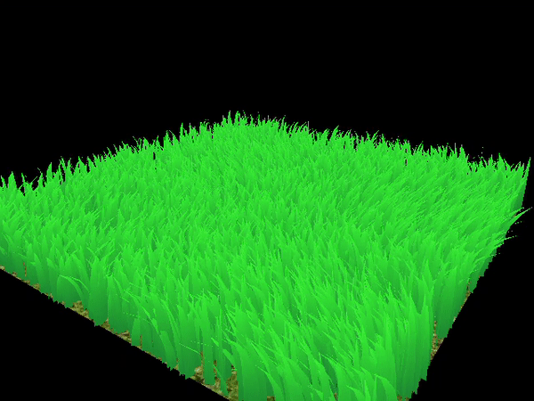
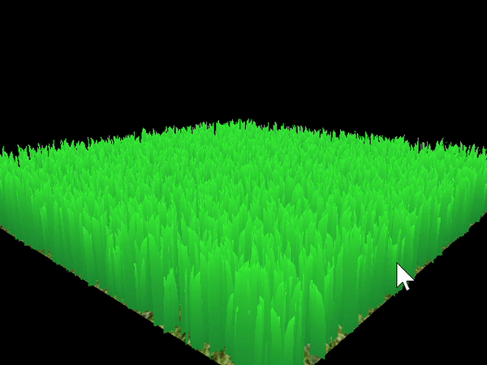
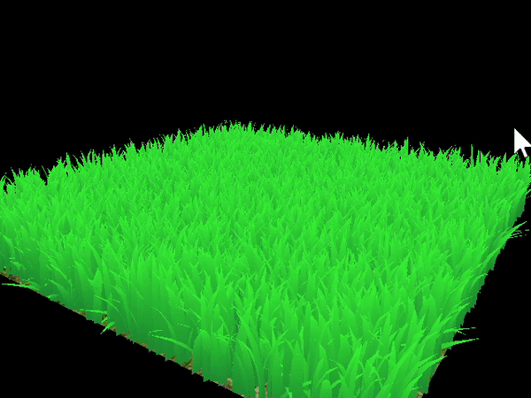
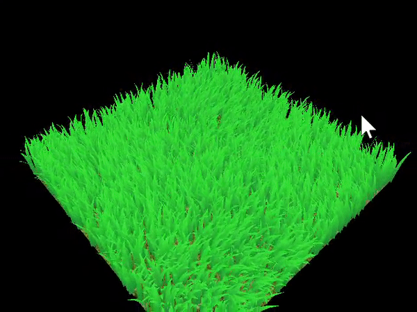
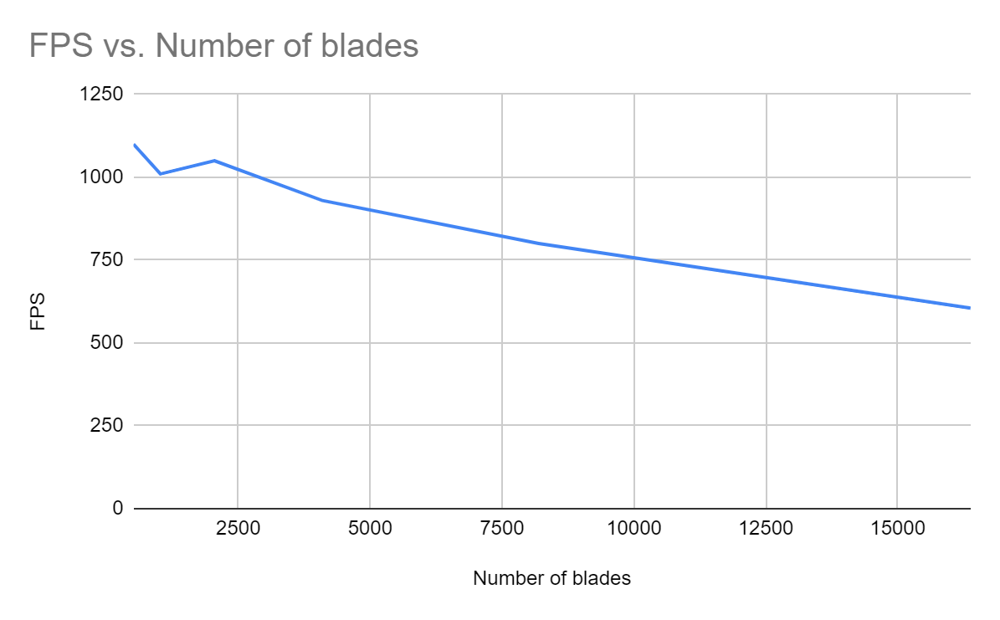

Instructions - Vulkan Grass Rendering
========================

**University of Pennsylvania, CIS 565: GPU Programming and Architecture, Project 4**

* Joshua Nadel
  * https://www.linkedin.com/in/joshua-nadel-379382136/, http://www.joshnadel.com/
* Tested on: Windows 10, i7-6700HQ @ 2.60GHz 16GB, GTX 970M (Personal laptop)

**Summary:**
This project presents a GPU-parallelized grass simulator and renderer created with Vulkan.

## Grass Rendering

This project is an implementation of the paper, [Responsive Real-Time Grass Rendering for General 3D Scenes](https://www.cg.tuwien.ac.at/research/publications/2017/JAHRMANN-2017-RRTG/JAHRMANN-2017-RRTG-draft.pdf).

As described in the paper, each blade of grass is represented by a three-point bezier curve, as well as width, height, and rotation values. Each blade is tessellated and drawn along these curves, and color mapped with a ramp over the surface's v coordinate.

## Simulating Forces

Forces are computed and applied to the tip of each grass blade, then the middle bezier point is updated to a reasonable midpoint position. All points are adjusted to preserve blade length.

The grass with gravity and resistant recovery forces

The grass with wind forces. Wind is globally computed as a combined sinusoidal function across 3D space. As described in the paper, wind's influence on each blade depends on how much the blade is facing into the wind and how tall the blade is.

## Culling tests

To save rendering costs, the renderer culls blades that are too far away, rotated perpendicular to the camera, or are outside of the visible scene.

### Orientation culling

Blades that are facing perpendicularly to the camera will render as thin slices, maybe even less than 1 pixel thick. In these cases, we can omit these blades from rendering.

### View-frustum culling

Blades that are not present in the camera's visibility frustum are not rendered.

### Distance culling

Blades are placed into 'buckets' based on their distance from the camera. Depending on which bucket a blade is in, it has an increasing chance of being culled. So, at max distance, all blades in further buckets are culled. This random selection is achieved by using the already randomized height parameter of each blade. While this does bias the visibility of taller grass blades at further distances, that is not necessarily a bad thing; taller blades will be more visible than shorter ones, so it makes sense to cull the shortest blades first. Distance culling is demonstrated clearly in the GIF above.

## Performance Analysis

Performance analysis done from default, unmodified camera view. With all culling methods active and 8192 blades, the renderer achieves roughly 800 fps.

With all culling optimizations off, the renderer achieves roughly 725 fps.

With only orientation culling, the renderer achieves roughly 740 fps.

With only distance culling, the renderer achieves roughly 785 fps.

With only frustum culling, the renderer achieves roughly 725 fps.

With all optimizations on, the relationship between the number of blades and the fps is presented in this chart:

## External Code
FPS computation code adapted from https://gamedev.stackexchange.com/questions/133173/how-to-calculate-fps-in-glfw?fbclid=IwAR1Qrc3KmuCxXTom-aJQ4VyFUsQC3PDFRGG46rFW2fCXIlvwyiHcYWOc9DM