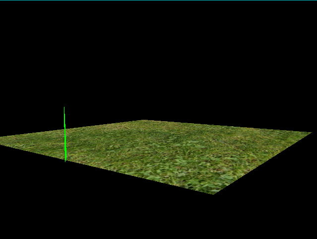
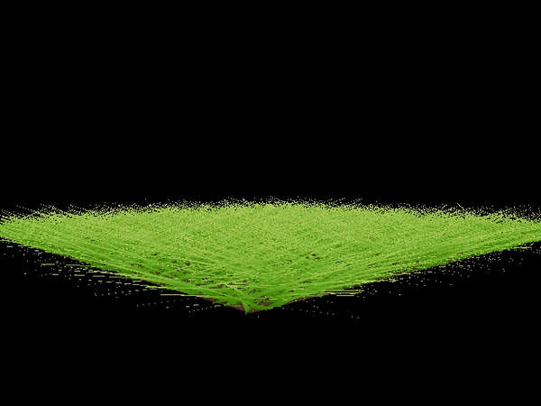

# Vulkan Grass Rendering
**University of Pennsylvania, CIS 565: GPU Programming and Architecture,
Project 4**

Caroline Lachanski: [LinkedIn](https://www.linkedin.com/in/caroline-lachanski/), [personal website](http://carolinelachanski.com/)

Tested on: Windows 10, i5-6500 @ 3.20GHz 16GB, GTX 1660 (personal computer)

// header gif here

## Project Description

The goal of this project was to utilize Vulkan to implement a real-time grass simulation and render, heavily based on this paper: [Responsive Real-Time Grass Rendering for General 3D Scenes](https://www.cg.tuwien.ac.at/research/publications/2017/JAHRMANN-2017-RRTG/JAHRMANN-2017-RRTG-draft.pdf). 

## Features

### Blade Model

For most of the pipeline, each blade of grass is represented as three control points (v0, v1, and v2) of a Bezier curve. Forces are applied on these points in the compute shader, as is culling. In the tessellation evaluation shader, this curve is evaluated using deCasteljau's.

* `v0`: the position of the grass blade on the geomtry
* `v1`: a Bezier curve guide that is always "above" v0 with respect to the grass blade's up vector
* `v2`: a physical guide for which we simulate forces on

Each blade has some additional parameters that are needed:

* `up`: the blade's up vector, which corresponds to the normal of the geometry that the grass blade resides on at v0
* Orientation: the orientation of the grass blade's face
* Height: the height of the grass blade
* Width: the width of the grass blade's face
* Stiffness coefficient: the stiffness of our grass blade, which will affect the force computations on our blade

All of the above data can be packed into four vec4s, such that `v0.w` holds orientation, `v1.w` holds height, `v2.w` holds width, and `up.w` holds the stiffness coefficient.

### Forces

#### Gravity

There are two components to the gravity force in this simulation. The first is environmental gravity, `gE`, represented by the typical 9.81 in the negative y-direction. The second component is front gravity, `gF`, which accounts for the blade's elasticity, which causes its tip to bend. `gF` is computed as `0.25 * || gE || * f`, where `f` is the front-facing direction of the blade.

The total gravity is computed as `gravity = gE + gF`.

#### Wind

#### Recovery

The recovery force is the counterforce to the other applied forces, wanting the blade to return to its initial upright position, and is based on Hooke's Law. Recovery is calculated as `recovery = (iv2 - v2) * stiffness`, where `iv2` is the original position of `v2` before any simulation and `v2` is the current position.

#### Simulation Correction

The translation for v2 is computed as `tv2 = (gravity + wind + recovery) * deltaTime`, but simply applying this translation can cause errors. What if this pushes v2 below the ground? How do we prevent the blade of grass from changing length? Corrections are applied to both `v1` and `v2` to ensure the simulation is robust (see paper and/or the compute shader).

### Culling

Three different culling heuristics are applied to every blade of grass to ensure we only render the blades we need to.

#### Distance Culling

We want to cull blades that are farther away from the camera, because 1) far away enough blades might be smaller than a pixel, which can cause aliasing artifacts, 2) the farther away a patch of grass is, the less blades it needs to look "full," and 3) at far away distances, too high of a blade density at a low viewing angle can cause z-fighting due to the lack of precision in depth values.

Since the blade density increase due to perspective is stronger near the horizon than when viewed from above, the distance from the camera to the blade is projected onto the local plane defined by the blade's `up` vector and then used for distance culling: `d_proj = || v0 − c − up * ((v0 − c) · up) ||`, where `c` is the camera position.

We accomplish distance culling by the using the projected distance and assigning it to one of `n` buckets between the camera position and some max distance (any blades beyond this max distance will not be rendered at all). In the first bucket, no blades are culled; in the second, one out of every n blades are culled, and so on.  

This gif shows distance culling using 3 buckets with a shortened max distance to exaggerate the culling effect:

#### Orientation Culling

Since blades have zero thickness, when looking at them from the side, they might appear at width that is less than a pixel, which can cause aliasing. We attempt to avoid this by culling blades based on their orientation to the camera. We can use a dot product between the camera's view direction and the blade's orientation direction and cull blades if this value is less than 0.9.

#### View Frustum Culling

Blades that are outside of the camera's view frustum wouldn't appear anyway, so we don't bother trying to render them. We check the visibility of three points: `v0`, `v2`, and `m`, where `m` is the approximated midpoint of the Bezier curve, calcualted by: `m = 0.25 * v0 + 0.5 * v1 + 0.25 * v2`. `v1` is not used in the visibility test, since `v1` is really just a Bezier guide that doesn't represent an actual position on the blade of grass. If neither of the three points are within the view frustum, the blade is culled.

I had some difficulty visualizing this one to see if it was working. One hacky way I used was increasing the height of a blade if its true position was outside the view frustum. You can see the blades at the bottom of the gif that go out of view will then suddenly appear since their height has been artificially increased:

## Analysis

## Bloopers

It took a *long* time before I had any grass appearing at all, so I was really happy to get to this stage:

(The issue: I was indexing into my input arrays in the evaluation shader using gl_PrimitiveID, but since each array was of length 1, only one blade would draw)

When I finally had all the blades showing up, it looked like they were at a house party that had the bass turned up to 11:

Changing some parameters makes this effect even worse (better?):

