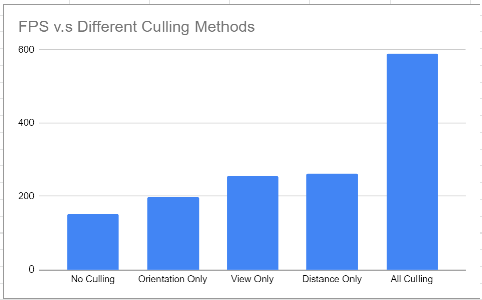
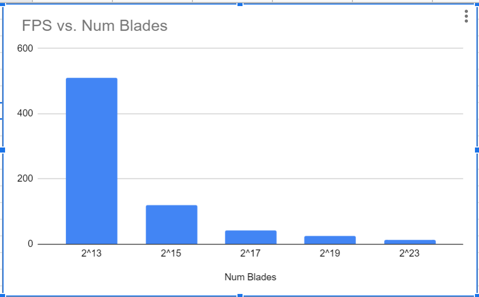

Vulkan Grass Renderer
================

**University of Pennsylvania, CIS 565: GPU Programming and Architecture, Project 4**

* Gangzheng Tong
* Tested on: Windows 10, i7-8750H @ 2.20GHz 16GB, RTX 2070 8GB (personal laptop)

### Overview

Vulkan implementation of  paper [Responsive Real-Time Grass Grass Rendering for General 3D Scenes](https://www.cg.tuwien.ac.at/research/publications/2017/JAHRMANN-2017-RRTG/JAHRMANN-2017-RRTG-draft.pdf)

**Grass Renderer** uses Vulkan compute shader to calculate different force influence on the grass and adjust the vertices position accordingly. With a few key points for each blade of grass generated, a customized tessellation shader interpolates the shape of the blades. Different culling methods used to improve the efficiency. 

### Features
* Force: 

  * Gravity: 
    * Consists of a world gravity, which is a constant vector gE of [0, -9.8, 0] and a customized center of gravity gF
    * The total gravity contribution is: gF = (1/4) * gE * gF
  * Recovery
    * The counter-force that brings the blades back to their equilibrium.
    * Use Hook's law to simulate
    * r = (v2' - v2) * stiffness
  * Wind
    * A simple sin function based on x, y and time used to simulate wind magnitude 

* Culling

  * Orientation 

    * If the blade (2D) is almost parallel to the view vector, we can cull it out since it's almost like a line from camera's point of view

  * View-frustum culling

    * If the blades end up outside of the view-frustum, we can cull them out to prevent them to enter the rendering pipeline

  * Distance culling

    * Depends on the projection distance, we can distribute the grass into a few evenly divided bins.

    * Cull out more grass if they belong to the bins far away, until the max distance reached and no blades left

      

### Performance Analysis

With all culling methods combined, I observed a signifianct improvement in performance. A few points worthy mentioning here:
* View-frustum culling has large impact when we zoom in close to the grass filed when a lot of blades ended up outside the view-frustum. 
* Distance cullling works great when we zoom out and when more blades are far away from the camera. 
* Orientation culling improved the FPS slightly. The reason is that the number of blades that happen to parallel (or close to parallel) with view direction is limited.

* Obviously, with more blades, the performance drops. The bottleneck is more likely occur in the computation unit rather than the memory bandwidth since most of the data reside in device memory after the rendering begins.

### References
*  [Responsive Real-Time Grass Grass Rendering for General 3D Scenes](https://www.cg.tuwien.ac.at/research/publications/2017/JAHRMANN-2017-RRTG/JAHRMANN-2017-RRTG-draft.pdf)
