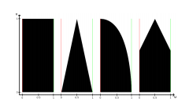

**University of Pennsylvania, CIS 565: GPU Programming and Architecture,
Vulkan Grass Rendering**

<p align="center">
  
</p>

* Grace Gilbert
  * gracelgilbert.com
* Tested on: Windows 10, i9-9900K @ 3.60GHz 64GB, GeForce RTX 2080 40860MB

## Overview
In this project I implemented a grass simulator and renderer using Vulkan. Each blade of grass is represented by a Bezier curve, which gets tessellated and shaped into a blade. I use a compute shader to perform physics calculations on the blades, adjusting the Bezier curve to apply gravity, an elastic recovery force, and wind. In this compute shader, I also cull blades to improve efficiency and remove some aliasing and flickering in the render.

## Resources
* [Responsive Real-Time Grass Grass Rendering for General 3D Scenes](https://www.cg.tuwien.ac.at/research/publications/2017/JAHRMANN-2017-RRTG/JAHRMANN-2017-RRTG-draft.pdf)
* [CIS565 Vulkan samples](https://github.com/CIS565-Fall-2018/Vulkan-Samples)
* [Official Vulkan documentation](https://www.khronos.org/registry/vulkan/)
* [Vulkan tutorial](https://vulkan-tutorial.com/)
* [RenderDoc blog on Vulkan](https://renderdoc.org/vulkan-in-30-minutes.html)
* [Tessellation tutorial](http://in2gpu.com/2014/07/12/tessellation-tutorial-opengl-4-3/)

## Implementation
### Pipeline Setup
This project utilizes the Vulkan pipeline. Much of this pipeline was set up in the base code, getting to the point of a textured ground plane rendering with a simple, moveable camera setup. To render grass, I set up an additional grass descriptor set layout and descriptor set, as well as a compute descriptor set to pass in the appropriate data into the compute shader. 

The grass descriptor set passes the model matrix for each group of grass blades into the grass rendering pipeline. This model matrix transforms all of the blades, ensuring that the patch of grass blades is located in the correct position.

The compute descriptor set passes in three buffers to the compute shader. The first of these buffers is the input blades data, which holds the control points for each blade's Bezier curve, as well as the blades height, width, orientation, stiffness, and the up vector of the surface it sits on. This data is what gets modified to apply physics to the blades. Next is another buffer of blades which will contain the blades that remain after culling. This is the buffer whose data gets passed into the render pipeline, as these are the blades to be rendered. Initially, prior to implementing culling, this buffer just copied the input blades data.  Finally, the compute shader takes in a buffer that stores the number of remaining blades. Each non-culled blade increments this number using an atomic add. This number ensures that we render the right number of blades each frame. 

The overall path of the pipeline is first the compute shader, where physics and culling are performed. The output data then goes to the grass vertex shader, which transforms the control points with the blade's model matrix. Then the tessellation control shader determines how finely to tesselate the blade. The tessellation evaluation shader shapes the tessellated blade. Finally, the fragment shader shades the blades, which are then rendered to the screen.

### Blade Tessellation and Rendering
Each blade of grass is represented as a Bezier curve with three control points, `v0`, `v1`, and `v2`, where `v0` is the base position of the blade. `v1` always lies directly above `v0`, and `v2` is what we apply forces to to animate the grass. There is also an up vector, defining the up direcction of the surface the blades sit on. The vectors are all 4D vectors, where the 4th element holds another piece of information: height, width, stiffness, and orientation. The following image represents the blade model described:


The vectors get passed into the vertex shader, where they are transformed into model space using the model matrix of the group of blades. The base position, `v0`, gets passed as the gl_Position into the tessellation control shader. The control shader sets the tessellation levels and passes along the control points and gl_Position into the tessellation evaluation shader. The tessellation levels control how subdivided the tessellation will be, which affects how smooth the curves in the grass blades will be.

The tessellation evaluation shader is where we shape the blades to curve along their Bezier curve and to have a grass blade shape along their width. To shape the blade along the Bezier curve defined by the control points, we perform a series of interpolations, following De Casteljau's algorithm:


We then use these interpolated values to find the final position of our current point in the tessellation:


The t value in the above equation determines the shape of the blade of grass, acheiving any of the shapes pictures below:



Finally, this position is projected into screen space with the view projection matrix.

The last step of the blade rendering is the fragment shader. This shader applies a gradient to the blades, making them dark green at their base and light green at the tips. This shading uses the height at the current portion of the blade. This height is a mix between the world space height and the individual blade space height. The world space height ensures that parts of the blades at the same height will have similar luminance. The blade space height ensures that even shorter blades still have some light green at their tips. The mixing of these two height spaces gives a more natural, varied look to the grass. 

Simply rendering the blades of grass gives the following results:

Quadratic Blades             |  Triangular Blades          
:-------------------------:|:-------------------------:
| 

I initially tried using lambertian shading based on the angle of the blade of grass, but this caused the color distrubition to be too varied. Because each blade is a flat plane, the orientation dramatically affects the lighting on it, causing all blades to have different tones of green, which does not look realistic. 


### Physics
The process of applying physics to the blades of grass involves calculating all forces that act upon the blades, and then updating the Bezier control points according to these forces. We are applying forces onto the third control point, `v2`, however there are measures we must take to ensure that when we apply the forces, we maintain certain properties: the blade must not fall through the ground plane, the length of the curved blade must be the same as the height of the blade to preserve length, and `v1` must be updated in relation to `v2`. 

We start by finding the updated position for `v2`, ensuring that it is above ground:


To find the updated position of `v1`, which must always be directly above the base of the blade, we find the length of the projection of the blade onto the ground and use this to find `v1`:


The final step is to ensure that the length of the curved blade is not longer than the height of the straight blade. We first evaluation the length of the Bezier curve:


Finally, we use this length and the height of the blade to set the final updated control points:


Below I describe how we calculate each of the forces that act on the blades of grass.

#### Gravity
To apply gravity onto the grass blades, we start with a direction and magnitude for gravity, which we use to find the environmental gravity:
```
GravtityDirection = (0, -1, 0)
GravityMagnitude = 9.8
GravityEnvironmental = (0, -9.8, 0)
```
Because blades are represented as flat planes, they can only fall in one direction, the direction that they are facing. To find this direction, I converted the orientation of the blade into a direction vector with simple trigonometry:
```
BladeFacingDirection = (cos(orientation), 0, sin(orientation))
```
We then calculate how much gravity contributes with respect to this facing direction:
```
GravityFront = (1/4) * length(GravityEnvironmental) * BladeFacingDirection
```
Finally, the total force of gravity is the sum of the environmental gravity and the front facing gravity:
```
GravityForce = GravityEnvironmental + GravityFront
```

With just gravity applied, the blades fall to the ground:


#### Recovery
Blades of grass have some elastic stiffness to them, allowing them to remain mostly upright even in the presence of gravity. To represent this, we add a recovery force to counter the gravitational force. We use Hooke's law to simulate this.

The recovery force is found by comparing the current position of `v2`, the third control point, to its original position at the start of the simulation, `iv2`. Knowing both `v2` and `iv2`, the recovery force is as follows: 
```
r = (iv2 - v2) * BladeStiffness.
```

With gravity and recovery only, the blades reach a state of equilibrium and do not move from this position:


#### Wind
The final force is the wind force. The wind force on each blade is determined by a function of the position of the base of each blade, wi(v0). This function defines the direction and strength of the wind at each point in space. For my wind functions, I used combinations of sinusoidal function and Fractal Brownian Motion noise. The noise breaks up some of the sinusoidal patterns in the wind.  

We next need to see how the wind affects the blade based on its the blade's orientation. Note that a wind force acting perpendicular to the front face of the blade will have no affect on that blade, as it can only bend along its front face. The affect of the wind becomes stronger as the direction and the front face become more aligned. The calculation for the final wind force is the following: 


With a light wind distribution purely based on and FBM noise function, the result of all three forces combined looks as follows:


### Culling
There are many blades of grass that we in fact do not have to render due to various reasons. We still must apply physics to all blades, as the physics may move an unrendered blade into a state where it must be rendered, but we can cut down the cost of rendering many blades using the following culling techniques.

#### Orientation
Some blades are angled in such a way that they appear very thin in camera. If the line of sight from the camera to that blade is perpendicular or nearly perpendicular to the front facing direction of the blade, the blade will appear as a very thing line. We can cull these blades, as they are nearly invisible. In addition to adding efficiency, this culling will reduce some flickering on screen. The thin blades may be smaller than a single pixel width, cuasing flickering as the line of the blade's edge flickers in and out of view. As few to none of the blades will be perfectly perpendicular to the camera view direction, we use a threshold to cull out these blades. The culling process looks like the following, where dirc is the front facing direction of the blade and dirb is the direction from the camera to the blade:


The following illustrates orientation culling using an extreme threshold to make the effect visible. Only blades that are very strongly facing the camera will remain unculled:


#### Frustum
Not all blades are within sight of the camera at all times. There is no need to render blades that the camera cannot see, so we can cull these blades. To do this, we check the visibility of three points on the blade, `v0`, `v2`, and `m`, which is a midpoint on the curve calculated as `m = (1/4)v0 + (1/2)v1 + (1/4)v2`. If all three points are not visible, then we can cull the blade.

To determine if a point is visible on camera, we project it into screen space and see if it falls within the bounds of the screen, with a small tolerance, as we want some buffer area around the screen to prevent seeing the blades disappear as the move off screen, as the curve may be off screen, but the blades have width, so their geometry might still be on screen.


The following illustrates frustum culling with a negative tolerance, culling blades that fall just within the frustum in order to make the effect visible. Important to notice is that the blades at and behind the far clip plane are being culled, so as the camera moves in and out, the cutoff line changes.  Also notice that at the edges, we can see blades flicker in and out of the screen, as they get culled when they move too far out.


#### Distance
Like with orientation culling, if a blade is very far fromm the camera, it may appear very small on screen, causing rendering artifacts. To reduce these artifacts, we cull blades based on their distance from camera. Rather than a sharp cutoff where blades go from being rendered to being culled a certain distance, we step the culling gradually in regions. We define a maximum distance and a number of regions. As the regions get further from camera, we cull increasingly more of the blades in that region. In the first region, no blades are culled, and in the last region all blades are culled, giving a smooth transition of blade density as we move farther from camera.

Distance from camera is calculated as follows:


Culling is determined according to this distance and the defined regions:


The following illustrates distance culling with extreme, quick density falloff to see the effect. The maximum distance is 50, so the blade density drops fairly close to camera, and there are 10 groups to illustrate the regions of density falloff:


## Performance Analysis


## Bloopers
In the process of trying to get the blades to render, I was indexing into the input arrays in the tessellation evaluation shader incorrectly. This caused all of my blades of grass to render as one single blade.


In fixing this same error, I lowered the number of blades to see what was happening, and got this image:


Another error that produced an interesting result was accidentally using the length of `v0` in my force application.  This caused very large forces to be applied when `v0` was very close to the origin, giving this image:


### Tessellating Bezier curves into grass blades

** Extra Credit**: Tessellate to varying levels of detail as a function of how far the grass blade is from the camera. For example, if the blade is very far, only generate four vertices in the tessellation control shader.


### Performance Analysis

The performance analysis is where you will investigate how...
* Your renderer handles varying numbers of grass blades
* The improvement you get by culling using each of the three culling tests

## Submit

Open a GitHub pull request so that we can see that you have finished.
The title should be "Project 6: YOUR NAME".
The template of the comment section of your pull request is attached below, you can do some copy and paste:  

* [Repo Link](https://link-to-your-repo)
* (Briefly) Mentions features that you've completed. Especially those bells and whistles you want to highlight
    * Feature 0
    * Feature 1
    * ...
* Feedback on the project itself, if any.
