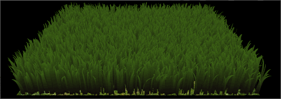

Vulkan Grass Rendering
================
**University of Pennsylvania, CIS 565: GPU Programming and Architecture, Project 4**

* Zheyuan Xie
* Tested on: Windows 10 Pro, i7-7700HQ @ 2.80GHz, 16GB, GTX 1050 2GB (Dell XPS 15 9560)

## Introduction
This project is an implementation of the paper, [Responsive Real-Time Grass Rendering for General 3D Scenes](https://www.cg.tuwien.ac.at/research/publications/2017/JAHRMANN-2017-RRTG/JAHRMANN-2017-RRTG-draft.pdf) A grass simulator and renderer is implemented with Vulkan.

## Features
### Graphics Pipeline
Two Vulkan pipelines are implemented in this project:
 - A Compute pipeline that generates Bezier curve of grass blades.
 - A Grass (graphics) pipeline that draw grass blades on the screen.

The compute pipeline consists of 1 shader: `compute.comp`.

The grass pipeline consists of 4 programmable shaders:
 - `grass.vert`
 - `grass.tesc`
 - `grass.tese`
 - `grass.frag`

### Physical Model
The physical model simulates natural forces on the grass blades. Three types of natural force are implemented:
 - Gravitational Force (`G`)
 - Recovery Force (`R`)
 - Wind Force (`W`)

| No Force | G | G+R | G+R+W |
|---|---|---|---|
|||||

### Culling
Three culling tests are implemented to improve the performance of rendereing:
 - Orientation test
 - View-frustum test
 - Distance test

| No Culling | Orientation Culling | Distance Culling|
|---|---|---|
||||

## Performance Analysis
The chart shows the rendering FPS with different number of blades and culling methods. The effect of culling becomes more significant when the number of grass blades is high.

